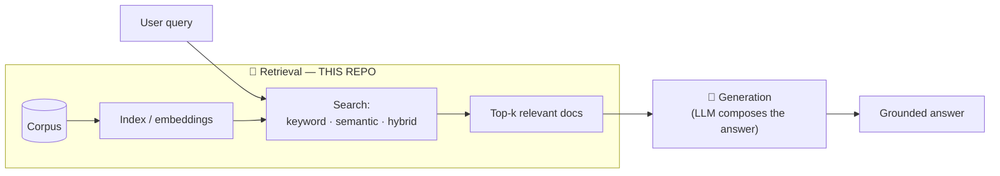
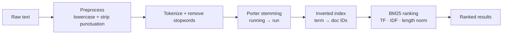
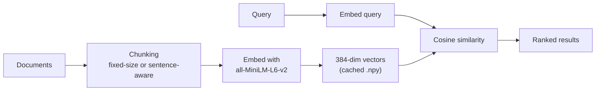

# RAG-Search-Engine

> A from-scratch search engine that powers the **retrieval** half of Retrieval-Augmented Generation — finding the most relevant passages in a corpus so an LLM can answer with grounded context instead of guessing.

Built in pure Python over a sample **movies** corpus, it implements three retrieval strategies from first principles: **keyword search** (BM25), **semantic search** (sentence embeddings + cosine similarity), and a **hybrid** strategy that fuses the two.

---

## Table of contents

- [Why this project](#why-this-project)
- [What is RAG, and where does this fit?](#what-is-rag-and-where-does-this-fit)
- [The three retrieval strategies](#the-three-retrieval-strategies)
- [How it works](#how-it-works)
- [Project structure](#project-structure)
- [Getting started](#getting-started)
- [Data setup](#data-setup)
- [Usage — keyword search](#usage--keyword-search)
- [Usage — semantic search](#usage--semantic-search)
- [Key concepts explained](#key-concepts-explained)
- [Caching](#caching)
- [Configuration](#configuration)
- [Roadmap](#roadmap)
- [Acknowledgements](#acknowledgements)

---

## Why this project

Most people reach for a library (`rank_bm25`, `faiss`, LangChain) and never see what happens underneath. This repo builds the retrieval layer **by hand** — the inverted index, the TF-IDF and BM25 maths, the embedding and cosine-similarity steps, and the chunking that splits documents into retrievable pieces — so every moving part is visible and tunable. It's an educational, readable reference for *how search actually works* before the LLM ever gets involved.

---

## What is RAG, and where does this fit?

**Retrieval-Augmented Generation (RAG)** improves an LLM's answers by first *retrieving* relevant context from a knowledge base and feeding it into the prompt, so the model reasons over real source material rather than only its training data. A RAG pipeline has two halves:



**This repository implements the retrieval half** — the part responsible for turning a query into the most relevant documents. Retrieval quality is the ceiling on RAG quality: if the right passage isn't retrieved, no LLM can use it. Getting this layer right is the point.

---

## The three retrieval strategies

| Strategy | Finds matches by… | Strength | Weakness | Status |
|---|---|---|---|---|
| **Keyword (BM25)** | Exact term overlap, ranked statistically | Precise on names, titles, jargon; fast; explainable | Blind to synonyms & meaning ("film" ≠ "movie") | ✅ Built |
| **Semantic** | Meaning, via vector embeddings | Understands paraphrase & concepts | Can miss exact keywords; needs a model | ✅ Built |
| **Hybrid** | Fusing both scores | Best of both — precision **and** meaning | More moving parts to tune | 🚧 Roadmap |

The two implemented strategies are deliberately complementary — which is exactly why the hybrid layer (combining them) is the natural next step.

---

## How it works

### Keyword pipeline (BM25)



Every document (`title` + `description`) is normalised, stemmed, and added to an **inverted index** that maps each term to the documents containing it, along with per-document term frequencies and lengths. At query time, BM25 scores each candidate document and returns the top results.

### Semantic pipeline (embeddings)



Each document is encoded into a 384-dimensional vector with the `all-MiniLM-L6-v2` sentence-transformer. A query is embedded the same way, and results are ranked by **cosine similarity** between the query vector and each document vector. Embeddings are cached to disk so they're computed once.

---

## Project structure

```
RAG-Search-Engine/
├── cli/
│   ├── keyword_search_cli.py     # CLI for keyword search (build, search, tf, idf, bm25…)
│   ├── semantic_search_cli.py    # CLI for semantic search (embed, search, chunk…)
│   ├── semantic_search.py        # SemanticSearch class: embeddings, cosine, chunking
│   └── lib/
│       ├── keyword_search.py     # InvertedIndex: TF, IDF, TF-IDF, BM25
│       ├── search_utils.py       # Constants + data loaders (movies.json, stopwords)
│       └── __init__.py
├── data/                         # Corpus + stopwords (you provide — see Data setup)
│   ├── movies.json               #   not committed (.gitignore)
│   └── stopwords.txt
├── cache/                        # Auto-generated index & embeddings (git-ignored)
├── .github/workflows/demo.yml    # CI scaffold
├── pyproject.toml                # Dependencies (Python ≥ 3.12)
└── README.md
```

> **Note:** the CLIs import their siblings (`from lib...`, `from semantic_search...`), so run them **from inside the `cli/` directory** (shown throughout below).

---

## Getting started

**Prerequisites:** Python 3.12+.

This project uses [`uv`](https://docs.astral.sh/uv/) (a `uv.lock` is expected), but plain `pip` works too.

```bash
# 1. Clone
git clone https://github.com/Dolamu-TheDataGuy/RAG-Search-Engine.git
cd RAG-Search-Engine

# 2a. With uv (recommended)
uv sync

# 2b. …or with pip + a virtual environment
python -m venv .venv
source .venv/bin/activate        # Windows: .venv\Scripts\activate
pip install nltk==3.9.1 "numpy>=2.4.4" "sentence-transformers>=5.4.0"
```

Dependencies and their roles:

- **nltk** — the Porter stemmer used in the keyword tokenizer.
- **numpy** — vector maths for cosine similarity and embedding storage.
- **sentence-transformers** — the `all-MiniLM-L6-v2` model for semantic embeddings (downloaded automatically on first run).

---

## Data setup

The corpus and stopwords live in `data/` and are **git-ignored**, so you provide them locally.

**`data/movies.json`** — a JSON object with a top-level `movies` array; each record needs an `id`, `title`, and `description`:

```json
{
  "movies": [
    {
      "id": 1,
      "title": "Inception",
      "description": "A thief who steals corporate secrets through dream-sharing technology..."
    },
    {
      "id": 2,
      "title": "The Matrix",
      "description": "A hacker discovers reality is a simulation and joins a rebellion..."
    }
  ]
}
```

**`data/stopwords.txt`** — one stopword per line (common words filtered out before indexing):

```
the
a
an
of
and
```

---

## Usage — keyword search

Run from the `cli/` directory. **Build the index once** before searching:

```bash
cd cli
python keyword_search_cli.py build
```

| Command | What it does | Example |
|---|---|---|
| `build` | Build & cache the inverted index | `python keyword_search_cli.py build` |
| `search <query>` | Inverted-index token match | `python keyword_search_cli.py search "space war"` |
| `bm25search <query> [limit]` | **Full BM25 ranked search** | `python keyword_search_cli.py bm25search "space war" 5` |
| `tf <doc_id> <term>` | Term frequency in a document | `python keyword_search_cli.py tf 1 dream` |
| `idf <term>` | Inverse document frequency | `python keyword_search_cli.py idf dream` |
| `tfidf <doc_id> <term>` | TF-IDF score | `python keyword_search_cli.py tfidf 1 dream` |
| `bm25idf <term>` | BM25 IDF component | `python keyword_search_cli.py bm25idf dream` |
| `bm25tf <doc_id> <term> [k1] [b]` | BM25 TF component (tunable) | `python keyword_search_cli.py bm25tf 1 dream 1.5 0.75` |

Example output:

```text
$ python keyword_search_cli.py bm25search "dream heist" 3
1. (1) Inception (Score: 8.42)
2. (7) Paprika (Score: 5.11)
3. (12) The Cell (Score: 3.98)
```

The `search` command does a fast, unranked token match; `bm25search` returns statistically **ranked** results — that's the one you want for real retrieval.

---

## Usage — semantic search

Also run from `cli/`. The first search builds and caches embeddings automatically.

| Command | What it does | Example |
|---|---|---|
| `verify` | Confirm the model loads | `python semantic_search_cli.py verify` |
| `embed_text <text>` | Embed arbitrary text | `python semantic_search_cli.py embed_text "a movie about dreams"` |
| `verify_embeddings` | Build/load corpus embeddings & report shape | `python semantic_search_cli.py verify_embeddings` |
| `embedquery <query>` | Embed a query | `python semantic_search_cli.py embedquery "heist thriller"` |
| `search <query> [--limit N]` | **Semantic ranked search** | `python semantic_search_cli.py search "movie about dreams" --limit 5` |
| `chunk <text> [--chunk-size N] [--overlap N]` | Fixed-size word chunking | `python semantic_search_cli.py chunk "long text..." --chunk-size 200 --overlap 20` |
| `semantic_chunk <text> [--max-chunk-size N] [--overlap N]` | Sentence-aware chunking | `python semantic_search_cli.py semantic_chunk "Sentence one. Sentence two." --max-chunk-size 4` |

Example output:

```text
$ python semantic_search_cli.py search "movie about dreams" --limit 3
1. Inception (Similarity: 0.6421)
 A thief who steals corporate secrets through dream-sharing technology...
2. Paprika (Similarity: 0.5893)
 A device that lets therapists enter patients' dreams...
3. The Cell (Similarity: 0.5210)
 A psychologist enters the mind of a comatose serial killer...
```

Notice this returns *Inception* for "movie about dreams" **without the word "dream" needing to appear in the query** — that's semantic matching doing what keyword search can't.

---

## Key concepts explained

**Tokenization pipeline** — raw text becomes searchable tokens through: lowercase → strip punctuation → split → remove stopwords → **Porter stemming**. Stemming collapses `running`, `runs`, `ran` → `run`, so a query matches regardless of word form.

**Inverted index** — a map from each term to the set of documents containing it (plus term frequencies and document lengths). It's what makes keyword lookup fast instead of scanning every document.

**TF-IDF** — **Term Frequency × Inverse Document Frequency**. Rewards terms that appear often *in a document* (TF) but discounts terms that appear *everywhere in the corpus* (IDF), so common words don't dominate.

**BM25** — the modern, stronger successor to TF-IDF. It adds two tunable knobs:
- **`k1` (default 1.5)** — term-frequency saturation: after a few occurrences, more repetitions add little.
- **`b` (default 0.75)** — length normalisation: prevents long documents from scoring unfairly high.

**Embeddings & cosine similarity** — the sentence-transformer maps text into a 384-dimensional vector where *meaning* becomes geometric closeness. Cosine similarity measures the angle between two vectors (1.0 = identical direction, 0 = unrelated), ranking documents by how close their meaning is to the query.

**Chunking** — long documents are split into smaller passages so retrieval returns focused context. Two approaches are implemented: **fixed-size** (N words with overlap) and **semantic/sentence-aware** (splitting on sentence boundaries), the latter keeping ideas intact.

---

## Caching

Both engines cache their expensive work so it's computed once:

- **Keyword** → `cache/index.pkl`, `cache/docmap.pkl`, `cache/term_frequencies.pkl`, `cache/doc_lengths.pkl` (via `build`).
- **Semantic** → `cache/movie_embeddings.npy` (on first search / `verify_embeddings`).

Delete the relevant cache files to force a rebuild after changing the corpus.

---

## Configuration

Defaults live in `cli/lib/search_utils.py`:

| Setting | Default | Meaning |
|---|---|---|
| `DEFAULT_SEARCH_LIMIT` | `5` | Results returned when no limit is given |
| `BM25_K1` | `1.5` | BM25 term-frequency saturation |
| `BM25_B` | `0.75` | BM25 length normalisation |

The semantic model (`all-MiniLM-L6-v2`) is set in `SemanticSearch.__init__` in `cli/semantic_search.py`.

---

## Roadmap

- **Hybrid search** — fuse BM25 and semantic scores into one ranking. The standard approaches are **Reciprocal Rank Fusion (RRF)** or a weighted score combination (e.g. `α · normalized_bm25 + (1 − α) · cosine`). Both engines already return ranked, scored results, so the fusion layer plugs directly on top.
- **Generation stage** — close the RAG loop by feeding retrieved passages to an LLM to compose grounded answers.
- **Unify cache paths** — the keyword engine writes to an absolute `cache/` (repo root) while the semantic engine writes `cache/` relative to the working directory; align these so results land in one place regardless of where commands run.
- **Tests & CI** — the workflow (`.github/workflows/demo.yml`) is currently a placeholder; wire it to run a real test suite.
- **Evaluation** — add retrieval metrics (precision@k, recall@k, MRR) to compare the three strategies on the same queries.

---

## Acknowledgements

- Built as a hands-on study of information retrieval and the retrieval foundations of RAG.
- Uses [`sentence-transformers`](https://www.sbert.net/) (`all-MiniLM-L6-v2`) for embeddings and [`nltk`](https://www.nltk.org/) for stemming.

---

*Maintained by [Dolamu-TheDataGuy](https://github.com/Dolamu-TheDataGuy).*